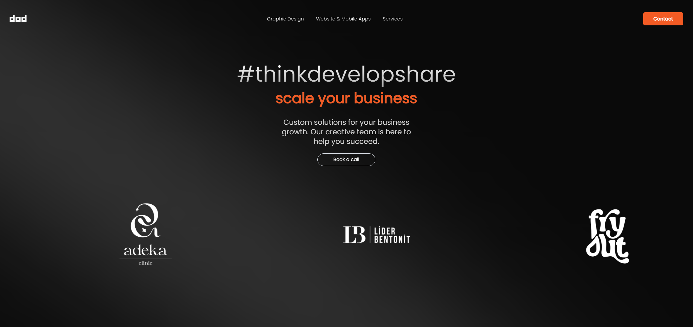

# DOD byte website



This project is a modern website built using **Next.js**, **React**, **TypeScript**, and **Tailwind CSS**. It incorporates dynamic design elements such as a responsive image carousel, parallax scrolling, and custom animations. Additionally, the project integrates UI components from **Radix UI** and form validation using **React Hook Form**.

## Features

- **Next.js** for server-side rendering and static site generation.
- **Responsive Design**: Implemented with Tailwind CSS and `react-responsive` to adapt across different screen sizes.
- **Carousel**: Image sliders powered by `react-slick` and `slick-carousel`.
- **Parallax Scrolling**: Smooth parallax effects using `react-parallax`.
- **Form Validation**: Handled by `React Hook Form` with schema validation using **Zod**.
- **Radix UI Components**: Custom UI elements like checkboxes, labels, and toasts from **Radix UI**.
- **Animations**: Smooth animations powered by **Framer Motion** and `tailwindcss-animate`.

## Project Structure

- `/components`: Contains reusable UI components such as sliders, navbar, and parallax effects.
- `/pages`: All the page routes for the website.
- `/public`: Stores public assets like images.
- `/styles`: Tailwind CSS and global styles.
- `/utils`: Helper functions or utilities used across the project.

## Technologies

- **Next.js 14.2.3**
- **React 18**
- **TypeScript 5**
- **Tailwind CSS 3.4.1**
- **Radix UI** components like Select, Checkbox, and Toast.
- **Framer Motion** for animations.
- **React Slick** and **Slick Carousel** for image sliders.
- **React Hook Form** and **Zod** for form handling.
- **React Parallax** for parallax effects.
- **Lucide Icons** for scalable vector icons.

## Installation

1. Clone the repository:

   ```bash
   git clone https://github.com/yourusername/my-app.git
   ```

2. Install the dependencies:

   ```bash
   npm install
   ```

3. Run the development server:

   ```bash
   npm run dev
   ```

4. Build the project:

   ```bash
   npm run build
   ```

5. Start the production server:

   ```bash
   npm start
   ```

## Project Scripts

- **dev**: Starts the development server.
- **build**: Builds the project for production.
- **start**: Starts the production server.
- **lint**: Runs ESLint to check for code quality.

## Contributing

Feel free to submit issues or pull requests to contribute to this project.

## License

This project is licensed under the MIT License.
